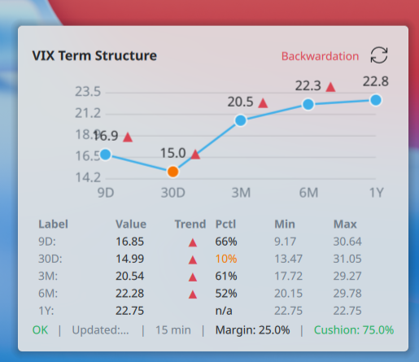

# VIX Term Structure Plasmoid

A KDE Plasma 6 widget that displays a volatility cash term structure curve directly on your desktop. Two markets, switchable in the settings: **VIX** (S&P 500, via Yahoo Finance) and **VSTOXX** (EURO STOXX 50, via STOXX).

## What it shows

Five maturities of the selected market.

**VIX** (`Market: VIX`, default) — CBOE volatility indices via Yahoo Finance:

| Ticker   | Label | Maturity  |
|----------|-------|-----------|
| `^VIX9D` | 9D    | 9 days    |
| `^VIX`   | 30D   | 30 days   |
| `^VIX3M` | 3M    | 3 months  |
| `^VIX6M` | 6M    | 6 months  |
| `^VIX1Y` | 1Y    | 1 year    |

**VSTOXX** (`Market: VSTOXX`) — EURO STOXX 50 volatility sub-indices via STOXX:

| Index | ISIN           | Label | Maturity  |
|-------|----------------|-------|-----------|
| V6I1  | DE000A0G87B2   | 1M    | 1 month   |
| V6I2  | DE000A0G87C0   | 2M    | 2 months  |
| V6I3  | DE000A0G87D8   | 3M    | 3 months  |
| V6I4  | DE000A0G87E6   | 6M    | 6 months  |
| V6I6  | DE000A0G87G1   | 12M   | 12 months |

It plots a line chart of the term structure and classifies the curve as Contango, Backwardation, Flat, or Unknown based on a simple heuristic (see below). This is a visual tool only — **not a trading signal**.

Every point also carries two context readouts, both optional in the settings:

- a **1-year percentile rank** with the trailing 1Y min/max (see [Percentile ranks](#percentile-ranks)),
- a **day-over-day trend arrow** against the previous close (see [Trend indicator](#trend-indicator)).

The optional table below the chart has the columns `Label | Value | Trend | Pctl | Min | Max`.

A status bar below the chart also shows a **Margin** and **Cushion** readout derived from the VIX 30D value (see [Margin & Cushion guidance](#margin--cushion-guidance)). These are risk-management guidelines only — **not financial advice**.



<sub>The screenshot predates the trend arrows, so it does not show the `Trend` column.</sub>


## Requirements

- KDE Plasma 6
- Python 3.9+
- `yfinance` and `pandas` Python packages — **only for the VIX market**. The VSTOXX market uses the standard library alone, so it keeps working without them.

## Installation

### 1. Install Python dependencies

System packages (recommended):
```bash
pip install --user yfinance pandas
```

Or in a virtual environment:
```bash
python3 -m venv ~/.local/share/vix-term-structure-plasmoid/venv
source ~/.local/share/vix-term-structure-plasmoid/venv/bin/activate
pip install yfinance pandas
```

If using a venv, edit `package/contents/code/fetch_vix.py` to use the venv Python, or create a wrapper script.

### 2. Install the plasmoid

```bash
scripts/install.sh
```

Or manually:
```bash
kpackagetool6 --type Plasma/Applet --install package
```

### 3. Add to desktop or panel

Right-click the desktop → Add Widgets → search "VIX Term Structure".

## Development / upgrade

```bash
scripts/upgrade.sh
```

Or launch directly for testing:
```bash
scripts/dev-reload.sh
# or
plasmoidviewer -a package -l floating -f planar
```

## Uninstall

```bash
scripts/uninstall.sh
```

Or:
```bash
kpackagetool6 --type Plasma/Applet --remove com.chrisotm.vixtermstructure
```

## Configuration

Open the widget settings to configure:

| Setting                  | Default | Range  | Description                        |
|--------------------------|---------|--------|------------------------------------|
| Market                   | VIX     | VIX, VSTOXX | Which volatility curve to show |
| Refresh interval (min)   | 15      | 1–1440 | How often to fetch new data        |
| Show values on chart     | true    | —      | Display value labels on each point |
| Show table               | true    | —      | Show the value table below chart   |
| Show percentile ranks    | true    | —      | Show the `Pctl` column in the table |
| Show trend arrows        | true    | —      | Show the `Trend` column and the arrows on the chart |
| Margin warning threshold (%)  | 30 | —    | Margin/Cushion turns "warning" at/above this usage |
| Margin critical threshold (%) | 50 | —    | Margin/Cushion turns "critical" at/above this usage |

## Curve classification

The curve state is a **heuristic indicator only**, not a trading signal. It uses the three front tenors of the selected market — `9D / 30D / 3M` for VIX, `1M / 2M / 3M` for VSTOXX:

- **Backwardation** — `near > mid` or `mid > far` (short-term stress)
- **Flat** — `|mid − far| < 0.5`
- **Contango** — otherwise (normal upward slope)
- **Unknown** — insufficient data to classify

## Percentile ranks

Each maturity is ranked against its own trailing **1 year of daily closes**: the percentile is the share of those closes at or below the current value. The table shows it in the `Pctl` column, next to the 1Y `Min` and `Max`. A low rank means the tenor sits near the bottom of its own past year, a high rank near the top.

The rank drives the color of both the table entry and the chart dot:

| Percentile | Color    | Chart dot                   |
|------------|----------|-----------------------------|
| ≤ 10 or ≥ 90 | negative | plus a translucent glow ring |
| ≤ 25 or ≥ 75 | neutral  | —                           |
| otherwise    | normal   | —                           |

Points without enough history show `—`. For VIX the `1Y` tenor has no percentile of its own (`n/a`); its `Min`/`Max` cells repeat the current value.

## Trend indicator

Every point is compared against its **previous daily close** — day-over-day, not intraday — so the arrow stays meaningful outside US market hours, when the VIX cash indices do not move. Changes within a fixed **0.5% deadband** count as flat (`--trend-deadband-pct` in `fetch_vix.py`).

| Direction | Glyph | Color    |
|-----------|-------|----------|
| up        | ▲     | negative (rising vol = rising risk) |
| down      | ▼     | positive |
| flat      | →     | muted    |

Arrows appear in the `Trend` column and next to the value labels on the chart; hover the column entry for the exact percentage change. With no previous close available (single data point) the cell stays empty.

## Margin & Cushion guidance

The status bar shows a suggested **maximum margin usage** as a function of the VIX 30D value, plus the resulting **Cushion** (`100% − margin usage`). The idea: the more volatile the regime, the more buffer you keep.

| VIX 30D | Max margin usage |
|---------|------------------|
| < 15    | 25%              |
| 15–20   | 25% → 30% (linear) |
| 20–30   | 30% → 35% (linear) |
| 30–40   | 35% → 40% (linear) |
| ≥ 40    | 50%              |

The readout is colored neutral at/above the **warning** threshold and negative at/above the **critical** threshold (both configurable). This is a personal risk-management heuristic — **not financial advice or a trading signal**.

In VSTOXX mode the same table is applied to the VSTOXX 1M value. The thresholds remain **calibrated on the VIX** and are deliberately not rescaled, so treat the readout there as a rough orientation only.

## Known limitations

- Data is only available during market hours and recent sessions. Values shown are the most recent available close.
- The widget will show the last known values when a refresh fails, with an error indicator.
- If `yfinance` or Python is not installed, the VIX market shows an error message. VSTOXX is unaffected.
- Refresh timer pauses when the widget is not visible, resuming with an immediate refresh when it becomes visible again.
- **VSTOXX is a delayed feed.** The "Updated" time is the fetch time, not the data time — hover it to see the vendor's own data date.
- **VSTOXX sub-indices are fixed-expiry, not constant-maturity.** Each one tracks a specific EURO STOXX 50 option expiry, so its remaining life shrinks day by day and the front point drops away shortly before it rolls. The VIX cash indices are constant-maturity and do not behave this way. Read the front of the EU curve with that in mind.

## Data disclaimer

> **VIX** data is provided through `yfinance` and Yahoo Finance public endpoints.
> `yfinance` is not affiliated with, endorsed by, or vetted by Yahoo.
> Refer to Yahoo Finance Terms of Service before any production or commercial use.
> VIX data is published by CBOE; this widget fetches it indirectly via Yahoo Finance.
>
> **VSTOXX** data comes from STOXX Ltd. public index endpoints (`quotes.stoxx.com`,
> with the public index pages as a fallback), using the API key those pages ship
> in their own HTML. VSTOXX® is a registered trademark of STOXX Ltd.
> Refer to the STOXX terms of use before any production or commercial use.
>
> This tool is for **informational and educational use only**.

## Technical risk: Plasma5Support

This plasmoid uses `org.kde.plasma.plasma5support` (`Plasma5Support.DataSource` with the `executable` engine) to run the local Python fetcher script from QML. This is a Plasma 6 **compatibility module** and may need replacement in a future Plasma version. If the widget stops working after a Plasma upgrade, check whether `Plasma5Support` is still available.

A future version should replace this with a local D-Bus helper or native extension for long-term stability.

## License

MIT
